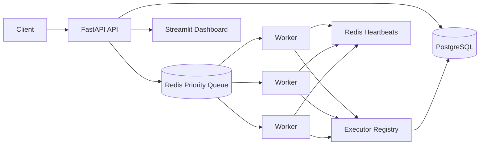

# Distributed AI Job Orchestration Platform

Production-grade backend system for asynchronous job scheduling, worker coordination, and distributed task execution.

## What Is Implemented

- FastAPI API under `/api/v1`
- JWT registration, login, refresh, and protected routes
- PostgreSQL SQLAlchemy models for users, jobs, and job logs
- Redis priority queue using sorted sets
- Dead Letter Queue using Redis hash entries
- Worker process with heartbeat, retry, exponential backoff with jitter, and executor dispatch
- Pluggable executor strategy for `resume_analysis`, `pdf_summary`, and `email_send`
- Metrics, queue stats, worker health, and DLQ endpoints
- Streamlit dashboard
- Alembic initial migration
- Docker Compose stack with API, 3 worker replicas, PostgreSQL, Redis, and dashboard

## Quick Start

1. Copy environment values:

```bash
cp .env.example .env
```

2. Start the full stack:

```bash
docker compose up --build
```

3. Open:

- API docs: <http://localhost:8000/docs>
- Admin dashboard: <http://localhost:8501>
- User dashboard: <http://localhost:8502>
- PostgreSQL from host tools: `localhost:5433`

## API Flow

Register:

```bash
curl -X POST http://localhost:8000/api/v1/auth/register \
  -H "Content-Type: application/json" \
  -d '{"email":"user@example.com","password":"password123"}'
```

Login:

```bash
curl -X POST http://localhost:8000/api/v1/auth/login \
  -H "Content-Type: application/json" \
  -d '{"email":"user@example.com","password":"password123"}'
```

Create a job:

```bash
curl -X POST http://localhost:8000/api/v1/jobs \
  -H "Authorization: Bearer $TOKEN" \
  -H "Content-Type: application/json" \
  -d '{"type":"resume_analysis","priority":1,"payload":{"text":"Backend Engineer with 5 years Python FastAPI Redis Docker. B.Tech."}}'
```

Check job status:

```bash
curl -H "Authorization: Bearer $TOKEN" http://localhost:8000/api/v1/jobs/$JOB_ID
```

## Dashboards

The project includes two Streamlit dashboards:

- Admin dashboard at <http://localhost:8501>: login-only admin access, live metrics cards, jobs by status, queue depth by priority, recent jobs, worker health, and Dead Letter Queue visibility.
- User dashboard at <http://localhost:8502>: separate registration/login pages, submit jobs, view personal job status/results/logs, cancel queued jobs, and retry failed or dead jobs.

Both dashboards use the FastAPI service through `API_BASE_URL`.
The API creates the default admin account from `ADMIN_EMAIL` and `ADMIN_PASSWORD` on startup. Normal registered users cannot access admin-only endpoints.

## Job Types

- `resume_analysis`: accepts `{ "text": "..." }` or `{ "file_path": "..." }`
- `pdf_summary`: accepts `{ "file_path": "...", "max_length": 220 }`
- `email_send`: accepts `{ "to": "...", "subject": "...", "body": "..." }`

`pdf_summary` uses OpenAI or Groq only when configured through `LLM_PROVIDER` and the relevant API key. Otherwise it returns a deterministic local extractive summary so local end-to-end testing works.

`email_send` defaults to `EMAIL_DRY_RUN=true`, returning a message id without contacting SMTP.

## Architecture



## Tests

```bash
pytest
```
# orchestretor
# job-orchestrator
